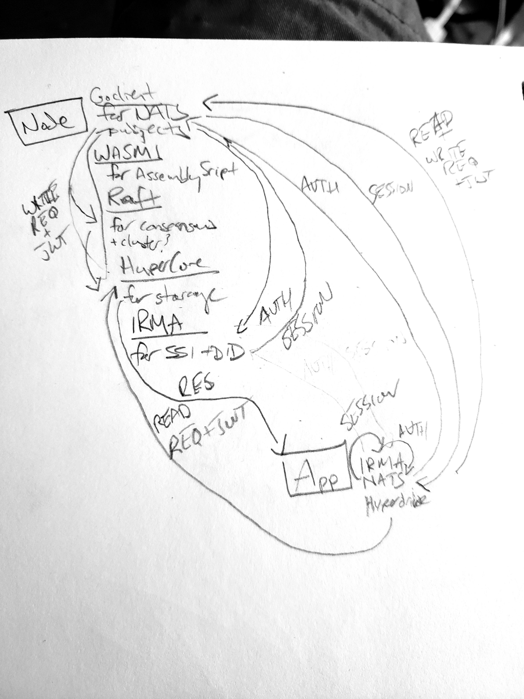
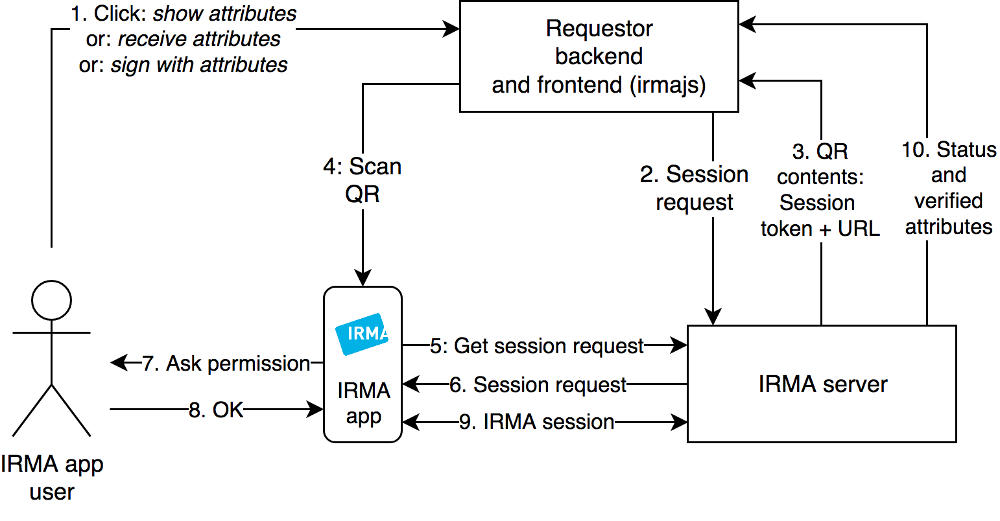
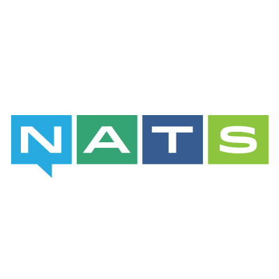
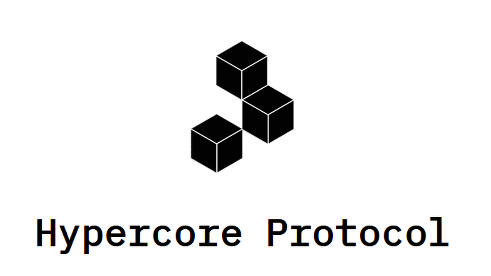
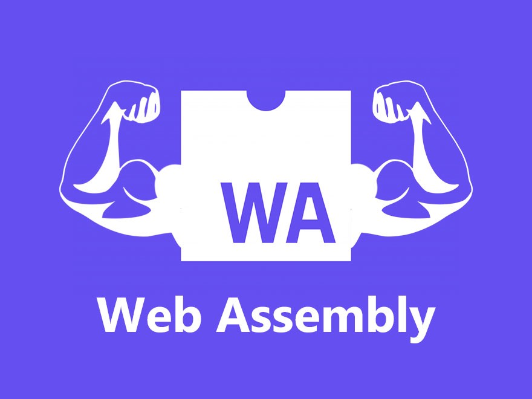
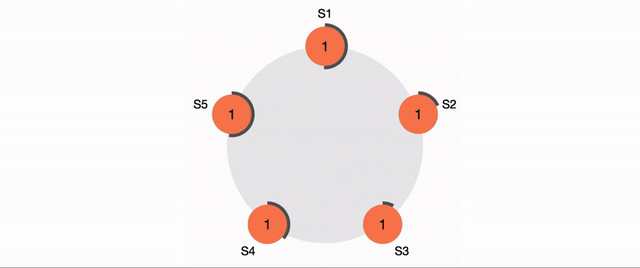

# CMesh: Cumulus Mesh Transport Protocol

CMesh is for the moment a toy just to give me an excuse to play with a bunch of new, interesting tech all at once. If you want to blame someone for it, I blame NATS... its too pretty not to get the gears turning dreaming up a machine just to use it... this is that machine :\

> Initial rough and very inaccurate imagined CMesh Node<->Client model

## The Dream Machine

The idea is still loosely formed, but the goal seems worth hacking toward: a privacy respecting, passwordless, identity requiring decentralized internet made up of modular and hotswappable service providers for each core component of the network (in build phase, service providers are: ID/Auth=IRMA;Event/Message Bus=NATS;Persistent State=HyperCore;Consensus=Raft;Smart Contracts=WASM).

## Modular & Decentralized Design, Familiar Monolithic Feeling UX

Seeing that NATS could be a component that helped underwrite a new kind of DLT and novel UX data flows (I think... probably not actually novel tbh), I started to think through/research additional components that would be necessary to stitch together the machine I was imagining. NATS serviced as the core means to immutably route events, but that does not a blockchain/decentralized smart contract platform make.

The components identified and providers/stacks chosen are the following:

### Router & Registrar: CMesh Nodes

In this model, the CMesh node running is acting as a router for the network, protecting the services operating behind its IAM gateway. Each router itself must authenticate their DID via IRMA handshake, and it is responsible for bootstrapping the protected services once the IAM and Router services have initialized and completed their handshake process.

The Router supports a function oriented address scheme I'm calling `FQMN` (fully qualified mesh name... original, I know...) that routes requests to protected services and returns the response while also invoking a consensus check on the response (to be defined as mock consensus service is rolled).

A 5 component (IAM, Router/Dispatcher, Registrar, State, Events) toy model is now cobbled together, first initializing the IAM service, then passing it to the Router service, and then after running its IRMA handshake test the router initializes its protected services (for now state, registrar and events), connecting each to the router and attaching each to the Dispatcher, and then runs through the `testState`, `testRegistrar` (necessary to succeed for the next test to resolve most addresses) and `parse_test_routes` methods of the Dispatcher, which uses the router to resolve route objects that are then dispatched to the appropriate services, calling back to the IAM service to authenticate requests before invoking state calls (read or write makes no difference, JWT needs to be valid first). Once initialized the router and its protected services are passed to the Events Miner which listens for changes to a log file. The client module currently just spams 30000 requests at the log file that the node is able to process (no IRMA handshaking/JWT going on atm, just FQMN strings spammed for the miner to process)

The Registrar is used to create and resolve named services, much like a normal domain registrar, making it easier to stitch distributed systems together.

Examples of FQMN structure and usage can be found in `services/router.go`.

### Identity Management and Auth: IRMA

IRMA is a beautiful spec, and in this case not being dependent or built for blockchain makes it the perfect choice for... whatever this is :\ lol. All sessions are first authenticated through IRMA, and JWTs are passed as needed via relevant NATS subjects (need to research this a ton more to be sure I fully grok both systems... this portion is the most critical component. feel like gRPC will be necessary, with NATS subjects being used for zk logs, but need to research this architecture first/thoroughly).

As noted above, this is one of the more "functional" parts of the toy atm. In `node/main.go` there's an `iam_bootstrap` call that first instantiates the IAM service, and then injects the IAM service into the Router service. It then calls the router's `TestSession` and `TestHandshake` methods that walks through the IRMA handshake process, then triggers the Dispatcher's `testState` method which calls a few reads/writes on the state service that are committed to a toy blockchain, and `testRegistrar` method which registers some FQMN addresses against `.mcom` domains.

Very much a toy given the private keys are shared between "client" and "server" (main and iam) and its using a hash function that's more convenient than secure. Also doesn't currently contain any of the attribute level functionality of IRMA systems. Service level state and struct/interface definitions live in `services/iam.go`, while `providers/iam/mock/provider.go` contains the mock provider API implementation. The initial struct-less implementation of the API has been added as the provider `toy`.

Docs for existing toy version can be found in [node/services/README.md](node/iam/README.md). Unit test coverage for public handshake steps for both valid and invalid credentials for toy version exists. Updated per-use case/function documentation and unit test coverage to follow.

### Event Sourcing Pipelines: NATS

NATS underwrites the entire machine's comms, from reads, to writes, to zk auth logging, to transaction bundling, and with some more thought on the necessary adapters likely even to interchain bridges, NATS is a critical component and inspiration to the entire machine. Its also very, very pretty.

### Distributed Storage: HyperCore/Hyperbee/Hyperdrive

Requiring storage, but not wanting to bloat the node's logic with rolling some kind of custom storage mechanism, the HyperCore stack stands out as an ideal option for carving up necessary event sourced data and persisting it in a way that should respect privacy while improving in performance with scale instead of degrading (I believe).

A state service layer has been started at `services/state.go` and a Mock service provider has been started at `providers/state/mock/provider.go`. It exposes `Read` and `Write` functions that first confirm with the `iam` service that a) a valid session exists (all requests to all services must have a valid JWT, or its required they be forced to the Auth() process to establish a session with the network), and b) the user has the required permissions for that service/resource.

### Smart Contract Runtime: WASMI

EVM is very solid and well established tech, but opting for a more open standard leaning into WASM feels like the better call. Rust devs will be able to port existing smart contracts to the environment, and AssemblyScript will be the supported/native language to keep CMesh smart contracts both accessible to newcomers, and portable to/from other distributed systems if devs so choose.

### Consensus & Cluster Management: RAFT

RAFT conensus is an established, fault tolerant and fast consensus mechanism that will underwrite state requests requiring auth, as well as any state change event handling, which for the moment I assume will include any necessary IRMA session state (haven't dug deep enough to determine IRMA session needs or related persistence strat).

Mock consensus providers will assume honesty and just modulus the transaction ID to select the "leader" index, which then all followers will process and add to the consensus of. In the real implementation, consensus would only require X number of confirmations and then miners would stop processing that consensus request.

Need to dive deeper down this rabbit hole to fully model the machine, but [Swarmkit](https://github.com/moby/swarmkit) and [Dragonboat](https://github.com/lni/dragonboat) are on the radar for post-mock consensus providers.

### ZKProofs: Undecided

Looking at the topology of the machine, it feels ideal to aim to architect as much of its innerworkings around ZKRollups/Cairo/Starknet-like ZK Proofs of Computation as possible, or at least to enable said featureset as part of the core functionality. This will be left for later given the added complexity and room for error it could introduce, but by the time the "toy" version of the above components are integrated a solution will be arrived at/model formed.

## CMTP: message protocol built for the distributed web

As HTTP did for the the web, CMTP allows a client to pass a request to a backend service operating on a distributed machine that is then able to be communicated to the other components of the machine with state being added to it in layers as each step of each opcode defined process entails, which then has the hash of the final message state streamed to create a complete audit trail and make the request's final state available for future processing/debugging/analytics/forensics.

One core aim of CMTP that makes it different is that its aim is to enable an auth'd by default environment flexible enough to protect privacy and enable multiple online identities to be managed from a core root identity. CMTP messages require a valid JWT, and without will be rejected with a status code instructing clients to prompt the identity creation/sync process/dialog. No valid IAM session, no network access for you.

Note: Currently this spec below is just capturing HTTP as pseudocode. CMTP ideation & development will likely not see much new work until the other components are more integrated, but initial HTTP mimicking Structs are loosely defined (though commented out) in `vendor/cmtp/cmtp.go` so any developments in the protocol will take place there.

<pre>

message_compiler(message){
  {
    headers:{
        status: message.status(),
        version: 'CMTP/0',
        transferred: message.bytesize(),
        referrerPolicy: message.referrerPolicy(),
        request: {
          accept: message.accept(),
          acceptEncoding: message.acceptEncoding(),
          acceptLanguage: message.acceptLanguage(),
          connection: message.connection(),
          host: message.host(),
          ifModSince: message.ifModSince(),
          ifNoneMatch: message.ifNoneMatch(),
          referrer: message.refferer(),
          secFetchDest: message.secFetchDest(),
          secFetchMode: message.secFetchMode(),
          secFetchUser: message.secFetchUser(),
          userAgent: message.userAgent(),
        },
        response: {
          acceptRanges: message.response.acceptRanges(),
          cacheControl: message.response.cacheControl(),
          contentEncoding: message.response.contentEncoding(),
          contentLength: message.response.contentLength()|message.response.bytesize(),
          contentSecurityPolicy: message.response.contentSecurityPolicy(),
          contentType: message.response.contentType(),
          date: message.response.date(),
          etag: message.response.etag(),
          expires: message.response.expires(),
          lastModified: message.response.lastModified(),
          strictTransportSecurity: message.response.strictTransportSecurity(),
          vary: message.response.vary(),
          (x(\w)) $1.each as $attr message.response.reflect($attr),
        }
    },
  }

}

</pre>
